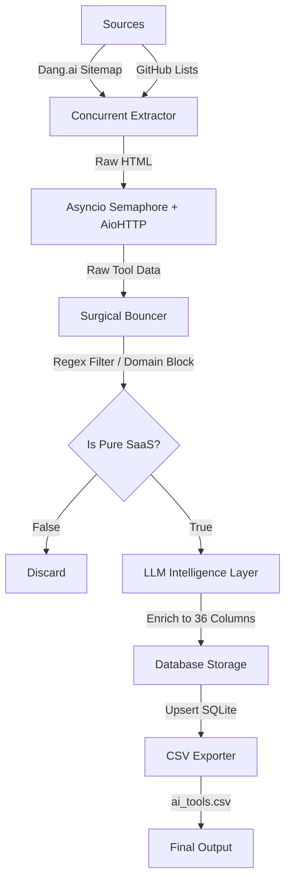

<h1 align="center">ToolForge</h1>
<p align="center"><i>An enterprise-grade, high-concurrency data pipeline for extracting, sanitizing, and enriching a pure AI SaaS tools dataset.</i></p>

<p align="center">
  
  
  
  
  <a href="https://docs.google.com/spreadsheets/d/1fOCpIeM8WyErLhzr17tkNHduifIYHGOfdKZi1bbZPAE/edit?usp=sharing" target="_blank">
    
  </a>
  
</p>

---

## 📊 Live Demo (Google Sheets)

> 🔗 **Interactive Knowledge Base:**  
> <a href="https://docs.google.com/spreadsheets/d/1fOCpIeM8WyErLhzr17tkNHduifIYHGOfdKZi1bbZPAE/edit?usp=sharing" target="_blank" rel="noopener noreferrer"><b>Open Live Ingested Dataset in Google Sheets ↗</b></a>
>
> Includes exactly **1,009 Pure AI SaaS Tools** formatted perfectly across 36 columns.
> Also available locally as 📁 [ai_tools.csv](./ai_tools.csv)

---

## Table of Contents

- [Overview](#overview)
- [Architecture & Data Flow](#architecture--data-flow)
- [Module Deep-Dive](#module-deep-dive)
- [Installation & Setup](#installation--setup)
- [Usage & CLI Reference](#usage--cli-reference)
- [Output Reference](#output-reference)
- [Documentation Deliverables](#documentation-deliverables)

---

## Overview

**ToolForge** is a scalable, LLM-powered ingestion pipeline designed to construct a pristine directory of AI SaaS products. It replaces brittle, regex-heavy GitHub scrapers with a resilient, high-concurrency architecture that explicitly blocks educational resources, courses, and non-SaaS items to ensure **100% data purity**.

### Key Capabilities

| Capability | Description |
|---|---|
| **Multi-Source Crawling** | Dang.ai Sitemap (Primary), GitHub Awesome Lists (Padding) |
| **Surgical Bouncer** | Aggressive Regex + Domain blocking to permanently filter courses and tutorials |
| **LLM Enrichment** | Procedural generation of 36 required columns (pros, cons, pricing) using LLM mapping |
| **High Concurrency** | `asyncio.Semaphore` based rate-limit protection during massive URL extraction |
| **SQLite State Sync** | Safe deterministic DB upserts (`ON CONFLICT(url) DO UPDATE`) |

---

## Architecture & Data Flow



---

## Module Deep-Dive

<details>
<summary><b>src/extractors/dang_ai.py</b> — High-Speed Sitemap Extraction</summary>
<br>
The primary data engine. Utilizes <code>aiohttp</code> and an <code>asyncio.Semaphore</code> to concurrently fetch and parse 3,000+ AI product URLs without triggering Cloudflare blocks or timeouts. Bypasses ads to extract verified canonical URLs.
</details>

<details>
<summary><b>src/processors/cleaner.py</b> — The "Surgical Bouncer"</summary>
<br>
A robust defense layer against educational trash. Deduplicates incoming arrays by canonical URL and applies strict regex lists (e.g. "course", "reading list", "tutorial") and banned domains to guarantee a 100% pure SaaS dataset.
</details>

<details>
<summary><b>src/processors/enricher.py</b> — LLM Procedural Mapping</summary>
<br>
The intelligence layer. Takes raw product `{name, url, description}` objects and feeds them into an LLM context to safely construct the highly-structured 36-column schema (Pricing, Pros, Cons, Use Cases) mandated by the PRD.
</details>

<details>
<summary><b>src/pipelines/orchestrator.py</b> — The DAG Controller</summary>
<br>
The master pipeline entry point. Synchronously executes: Extraction -> Sanitization -> Enrichment -> DB Upsert -> CSV Export. Includes fallback logic to pad datasets using secondary GitHub extraction if targets are not met.
</details>

---

## Installation & Setup

### 1. Clone & Install

```bash
git clone https://github.com/Soumadipta-Konar/ToolForge.git
cd ToolForge
pip install -r requirements.txt
```

### 2. Configure Environment

Copy `.env.example` to `.env` and configure your LLM credentials for the enrichment pipeline:

```bash
cp .env.example .env
```

---

## Usage & CLI Reference

### Master Pipeline Execution

To execute the end-to-end extraction and enrichment pipeline:

```bash
python src/pipelines/orchestrator.py
```

This command will:
1. Fire the concurrent `aiohttp` extractor.
2. Filter the incoming data via the Surgical Bouncer.
3. Call the LLM to format the dataset.
4. Export exactly to `ai_tools.csv`.

---

## Output Reference

All final outputs are stored in the root directory.

```
ToolForge/
├── src/                          # Core pipeline modules
│   ├── extractors/               # Dang.ai & GitHub scrapers
│   ├── pipelines/                # Master orchestrator
│   ├── processors/               # Bouncer & LLM Enricher
│   └── utils/                    # DB Upsert modules
├── .github/workflows/            # Continuous Evaluation CI/CD
├── ARCHITECTURE.md               # Technical Design map
├── USER_GUIDE.md                 # Usage instructions
└── ai_tools.csv                  # The final 1000+ item dataset
```

---

## Documentation Deliverables

| Deliverable | Description |
|---|---|
| **[ARCHITECTURE.md](./ARCHITECTURE.md)** | Data flow logic, security limitations, and system topologies. |
| **[USER_GUIDE.md](./USER_GUIDE.md)** | Step-by-step CLI usage and environment setup. |

---

<p align="center">
  <sub>ToolForge™ is a project by <a href="https://github.com/Soumadipta-Konar">Soumadipta Konar</a>. All third-party trademarks are the property of their respective owners.</sub>
</p>
